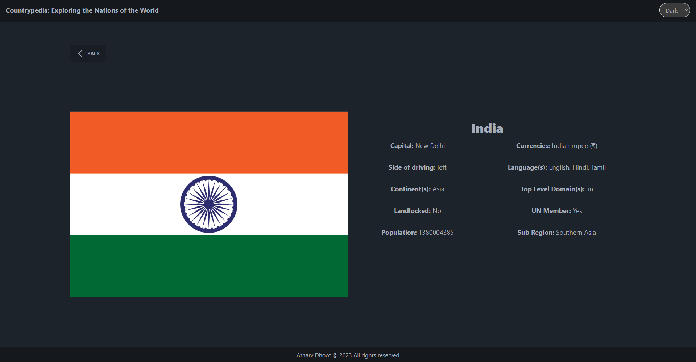
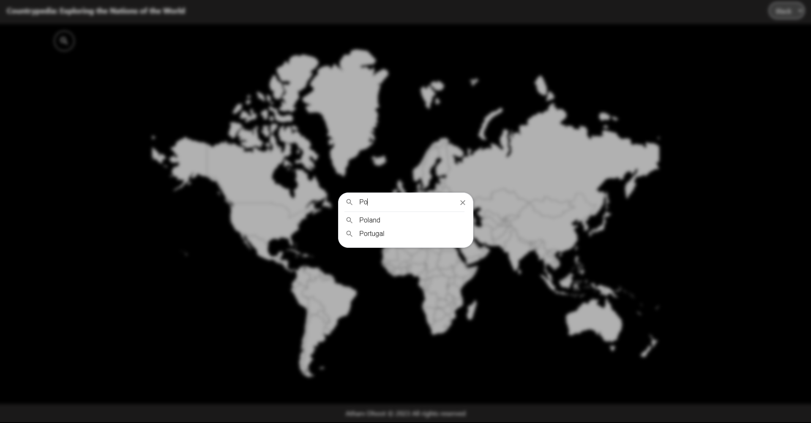

# Countrypedia: Exploring the Nations of the World

Explore the interactive world map and discover country data from around the globe. Made with React.js and Tailwind CSS.

## Screenshots

### Light Theme

### Dark Theme

### Black Theme

## Features
- Interactive world map from `react-svg-worldmap`
- Country data from REST COUNTRIES API
- Redux integration for caching of data for minimal api calls
- Search functionality for hard to locate countries with `react-search-autocomplete`
- Beautiful and Responsive UI with Tailwind CSS

## License
CountryPedia is free and open source software under the terms of MIT License.